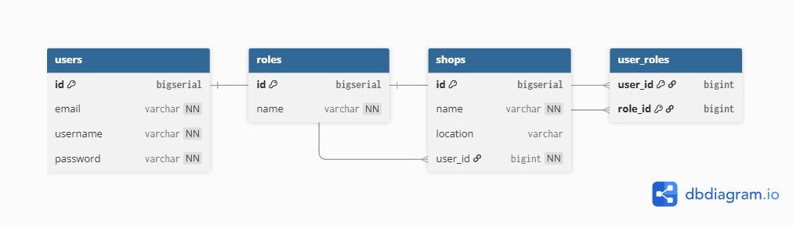
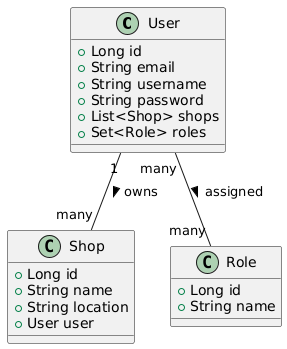
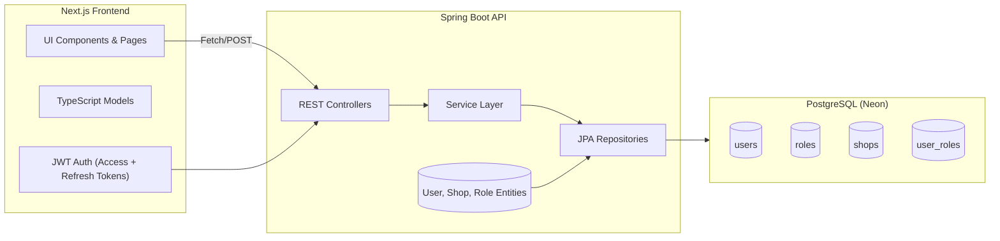

# JWT-Auth

## 🧩 Database Schema (PostgreSQL / Neon)

Users

| Column   | Type         | Constraints     |
| -------- | ------------ | --------------- |
| id       | BIGSERIAL    | PRIMARY KEY     |
| email    | VARCHAR(255) | UNIQUE NOT NULL |
| username | VARCHAR(255) | UNIQUE NOT NULL |
| password | VARCHAR(255) | NOT NULL        |

Roles

| Column | Type         | Constraints     |
| ------ | ------------ | --------------- |
| id     | BIGSERIAL    | PRIMARY KEY     |
| name   | VARCHAR(100) | UNIQUE NOT NULL |

Shops

| Column   | Type         | Constraints                            |
| -------- | ------------ | -------------------------------------- |
| id       | BIGSERIAL    | PRIMARY KEY                            |
| name     | VARCHAR(255) | NOT NULL                               |
| location | VARCHAR(255) |                                        |
| user_id  | BIGINT       | REFERENCES users(id) ON DELETE CASCADE |

user_roles

| Column      | Type               | Constraints                            |
| ----------- | ------------------ | -------------------------------------- |
| user_id     | BIGINT             | REFERENCES users(id) ON DELETE CASCADE |
| role_id     | BIGINT             | REFERENCES roles(id) ON DELETE CASCADE |
| PRIMARY KEY | (user_id, role_id) |                                        |

## 🧩 Database Schema (ERD)



## 🧱 Spring Boot Entities

User.java

```java
    @Entity
    @Table(name = "users")
    public class User {

        @Id
        @GeneratedValue(strategy = GenerationType.IDENTITY)
        private Long id;
        
        private String email;
        private String username;
        private String password;

        @OneToMany(mappedBy = "user", cascade = CascadeType.ALL, fetch=FetchType.EAGER)
        @JsonManagedReference
        private List<Shop> shops;

        @ManyToMany(fetch=FetchType.EAGER)
        @JoinTable(
            name = "user_roles",
            joinColumns = @JoinColumn(name = "user_id"),
            inverseJoinColumns = @JoinColumn(name = "role_id")
        )
        private Set<Role> roles;
        //...
    }
```

Shop.java

```java
    @Entity
    @Table(name="shops")
    public class Shop {

        @Id
        @GeneratedValue(strategy = GenerationType.IDENTITY)
        private Long id;
        // private String user_id;
        private String name;
        private String location;

        @ManyToOne
        @JoinColumn(name = "user_id", nullable = false)
        @JsonBackReference
        private User user;
        //...
    }
```

Role.java

```java
    @Entity
    @Table(name = "roles")
    public class Role {
        
        @Id
        @GeneratedValue(strategy = GenerationType.IDENTITY)
        private Long id;
        private String name;
        //...
    }
```

## 🧱 Backend Entities (UML)



<!-- @startuml
class User {
  +Long id
  +String email
  +String username
  +String password
  +List<Shop> shops
  +Set<Role> roles
}

class Shop {
  +Long id
  +String name
  +String location
  +User user
}

class Role {
  +Long id
  +String name
}

User "1" -- "many" Shop : owns >
User "many" -- "many" Role : assigned >
@enduml -->

## 🧠 Architecture Diagram

Purpose: High-level overview showing how your frontend, backend, and database interact.

```pgsql
    [ Next.js Frontend ] <---> [ Spring Boot API ] <---> [ PostgreSQL DB ]
                                  |
                                  └── JWT Auth (Access + Refresh Tokens)
```



## Sample Data

Users

```json
    [{
        "id": 3,
        "username": "Alex",
        "password": "hashedpassword1",
        "email": "alex@example.com",
        "shops": [{
            "id": 1,
            "user_id": 3,
            "name": "Smoke Shop",
            "location": "Tallahassee, FL",
        }],
        "user_roles": [{
            "user_id": 3,
            "role_id": 1,
        }],
    }]
```

Shops

```json
    [{
        "id": 1,
        "user_id": 3,
        "name": "Smoke Shop",
        "location": "Tallahassee, FL",
        "user": {
            "id": 3,
            "username": "Alex",
            "password": "hashedpassword1",
            "email": "alex@example.com",
        }
    }]
```

Roles

```json
    [{
        "id": 1,
        "name": "ROLE_ADMIN",
        "user_roles": [{
            "user_id": 3,
            "role_id": 1,
        }]
    },
    {
        "id": 2,
        "name": "ROLE_USER",
        "user_roles": []
    }]
```
